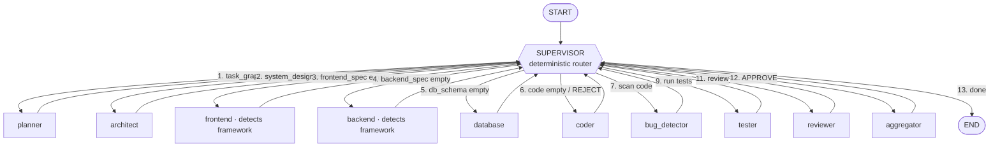

# Multi-Agent Architect

A production-grade **multi-agent system** built with [LangGraph](https://langchain-ai.github.io/langgraph/)
using the **supervisor pattern**. Give it a software requirement in plain
English and eleven specialized agents collaborate to plan, design (frontend,
backend, database), implement, security-audit, test, review, and compile a full
design-and-implementation document — self-correcting through bug-fix and
test-fix loops along the way.


> **Runs free, offline, out of the box.** A built-in mock mode returns
> deterministic responses so you can run the whole pipeline with **no API key
> and zero cost**. Flip one flag to switch to real GPT-4o / gpt-4o-mini.

---

## Architecture

One **supervisor** sits at the center. After every agent finishes, control
returns to the supervisor, which looks at the shared state and decides who runs
next — until the work is done.



Every worker has a plain edge back to the supervisor. The **fix-loops** are the
supervisor re-routing to the `coder`:

- `bug_detector` reports `BUGS_FOUND` → supervisor sends control back to `coder`
- `tester` reports `FAIL` → back to `coder`
- `reviewer` returns `REJECT` → back to `coder`

Each loop is bounded by a **circuit breaker** (`max_iterations`, default 3) so
the pipeline always terminates.

---

## The 11 agents

| Agent | Model tier | Responsibility |
|-------|-----------|----------------|
| **supervisor** | — (pure Python) | Deterministic router; returns a validated `RouteDecision` |
| **planner** | gpt-4o-mini | Breaks the requirement into an ordered task list |
| **architect** | gpt-4o-mini | High-level system design |
| **frontend** | gpt-4o-mini | Detects the frontend framework, writes a framework-specific spec |
| **backend** | gpt-4o-mini | Detects the backend framework, writes a framework-specific spec |
| **database** | gpt-4o-mini | Relational schema (tables, keys, indexes) |
| **coder** | gpt-4o-mini | Generates/revises the implementation |
| **bug_detector** | gpt-4o-mini | Security/reliability/performance audit → `BUGS_FOUND` or `CLEAN` |
| **tester** | gpt-4o-mini | Tests + static checks → `FAIL` or `PASS` |
| **reviewer** | **gpt-4o** | Holistic review → `APPROVE` or `REJECT` |
| **aggregator** | gpt-4o-mini | Compiles everything into a 10-section markdown document |

**Framework-aware:** the frontend/backend agents detect the stack from your
requirement (e.g. `Next.js → nextjs`, `FastAPI → fastapi`, also Nuxt,
SvelteKit, Vue, Angular, Remix, Astro, Express, Django, Rails, Spring, Gin,
NestJS, …) and generate idiomatic specs — never generic output.

---

## Project structure

```
multi-agent-architect/
├── agents/          # the 11 agents (supervisor + 10 workers)
├── core/
│   ├── state.py     # shared AgentState (TypedDict) + RouteDecision
│   ├── llm.py       # complete(): mock/real switch, model tiering, retry
│   ├── tools.py     # framework detection + helpers (no LLM)
│   └── graph.py     # the StateGraph wiring + MemorySaver checkpointer
├── api/main.py      # FastAPI: POST /run, GET /status/{thread_id}
├── config.py        # pydantic-settings config (reads .env)
├── test_run.py      # smoke test -> writes output.md
├── requirements.txt
└── .env.example
```

---

## Quick start

```bash
# 1. create a virtual environment
python -m venv .venv
# Windows:
.venv\Scripts\activate
# macOS/Linux:
source .venv/bin/activate

# 2. install dependencies
pip install -r requirements.txt

# 3. run the full pipeline (MOCK mode — free, no API key)
python test_run.py
```

`test_run.py` prints each agent step as it runs and writes the final document to
`output.md`.

### Run the API

```bash
uvicorn api.main:app --reload --port 8000
```

- Interactive docs: <http://localhost:8000/docs>
- `POST /run` — body `{ "requirement": "...", "thread_id": "job-1" }` → returns
  `{ final_document, steps_taken, frameworks_detected }`
- `GET /status/{thread_id}` — the persisted state snapshot for a run

### Going real (GPT-4o)

```bash
cp .env.example .env        # then edit .env:
#   USE_MOCK_LLM=false
#   OPENAI_API_KEY=sk-...
#   (optional) LANGCHAIN_TRACING_V2=true + LANGCHAIN_API_KEY=ls-...
python test_run.py
```

A full real run is ~20–30 LLM calls (supervisor + reviewer on **gpt-4o**, the
rest on **gpt-4o-mini**); loop counts vary per run, bounded by `max_iterations`.

---

## Configuration

All settings load from environment / `.env` via `config.py`:

| Setting | Default | Meaning |
|---------|---------|---------|
| `USE_MOCK_LLM` | `true` | `true` = free offline mocks; `false` = real OpenAI |
| `OPENAI_API_KEY` | — | required when `USE_MOCK_LLM=false` |
| `SUPERVISOR_MODEL` | `gpt-4o` | model for the supervisor tier |
| `REVIEWER_MODEL` | `gpt-4o` | model for the reviewer |
| `WORKER_MODEL` | `gpt-4o-mini` | model for the other 8 workers |
| `MAX_ITERATIONS` | `3` | circuit-breaker limit for fix-loops |
| `LANGCHAIN_TRACING_V2` | `false` | enable LangSmith tracing |
| `LANGCHAIN_API_KEY` | — | LangSmith key (if tracing) |

---

## How it works (the concepts)

**The mental model.** A LangGraph app is a **State** (shared data) → **Nodes**
(functions that update state) → **Edges** (who runs next) → compile → invoke.

- **Shared state** (`core/state.py`): a `TypedDict` every agent reads and writes.
  Each agent returns only a *partial* update, which LangGraph merges. The
  `messages` field uses the `add_messages` reducer, so it **appends** instead of
  overwriting — everything else is last-write-wins.

- **The supervisor pattern** (`agents/supervisor.py`): the routing rules are
  *deterministic predicates on state* (`if system_design == "" → architect`), so
  we evaluate them in plain Python rather than paying an LLM to decide. The
  choice is still returned as a validated Pydantic `RouteDecision`, honoring the
  "structured output, never free-text parsing" rule. Workers always edge back to
  the supervisor, which re-evaluates after every step.

- **Self-healing loops** (`agents/coder.py`): when the coder re-runs after a bug,
  test failure, or rejection, it **clears the stale `bug_report`,
  `test_results`, and `review_decision`** — because the code changed, the old
  verdicts no longer apply. This forces a fresh audit → test → review pass and is
  what makes the loops actually converge instead of spinning on stale data.

- **Circuit breaker + guaranteed termination**: `iteration_count` and
  `bug_iteration_count` cap the fix-loops; once spent, the supervisor skips to
  review and always routes to the aggregator → END, so a stubborn run can never
  dead-end.

- **Mock vs real** (`core/llm.py`): every agent calls one async helper,
  `complete(role, system, user)`. It centralizes the mock/real switch, model
  tiering, and `tenacity` retry-with-backoff on real calls — so agents never
  know or care which mode they're in.

---

## Tech stack

LangGraph · LangChain · langchain-openai · Pydantic / pydantic-settings ·
FastAPI · Uvicorn · Tenacity · LangSmith (optional).

## License

**TBD.** No license has been chosen yet — note that a public repository without
a license is, by default, *not* legally reusable by others. Adding one (e.g.
MIT) is a single-file drop-in whenever you decide.
